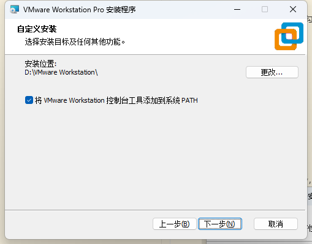
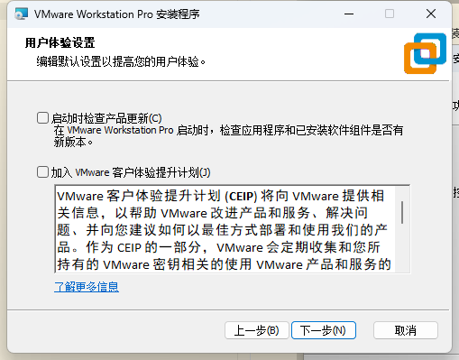

# 下载Ubuntu-Desktop
一般情况下，最好是通过 [官网](https://ubuntu.com/download/desktop) 下载Ubuntu的发行版。

由于众所周知的原因，国内下载可能遇到速度慢或者无法访问的问题。

这种时候，我们可以去各种国内镜像站上面寻找，比如：[清华源](https://mirrors.tuna.tsinghua.edu.cn/ubuntu-releases/)、[中科大源](https://mirrors.ustc.edu.cn/ubuntu-releases/)

根据自己电脑的处理器架构（一般来说,x86架构的电脑无脑选择`amd64`即可），再点击所需的文件，即可开始下载

Tips: `live-sever`是轻量级服务器版本（也称为无头服务器），有完整的终端功能，系统占用资源更少，预安装的软件包较少，但是没有图形界面，不太适合Windows用户上手。如果你执意要用，也可以通过终端安装图形界面，此处按下不表。

# 下载VMware Workstation Pro
在某个日子里，VMware宣布VMware Workstation Pro面向个人开发者免费。

现在，你只需要注册一个博通账号即可免费下载VMware Workstation Pro。

[VMware官网](https://www.vmware.com/products/desktop-hypervisor/workstation-and-fusion)

点击后会跳转到博通官网，按指引注册账号并登录。

登录以后打开 https://support.broadcom.com/group/ecx/productdownloads?subfamily=VMware%20Workstation%20Pro&freeDownloads=true 

选择自己想要的版本，这里以17.6.4为例。

条例打开以后，关闭即可，勾选同意左上角条款，再点击小云朵即可下载（可能会要求补充信息，乱填就行）。

下载完成后，安装`VMware`

如果你不知道什么是hyper-v，也不清楚自己是否开启了，就勾选自动安装，没有这一步也是正常的。

选择一个你喜欢的位置，安装路径最好没有中文，为了省事，可以顺便把添加到`PATH`勾选上。

这里勾不勾都行。

这个最好都勾上，方便。

中途会弹出一些窗口，安装虚拟机驱动，一路同意、接受即可。安装完成以后，重启电脑。

# 配置虚拟机
运行VMware Workstation Pro。

创建新的虚拟机

如果要安装的虚拟机系统，是市面上常见的操作系统，选择`典型`，操作会容易很多。为了让教程更具普适性，这里就不展示了。

这里选择`安装程序光盘映像文件`的话，会进入简易安装（就是上面的`典型`）。

根据自己的需要调整虚拟机的放的位置，有没有中文都行，下一步。
## 处理器、内存配置

处理器数量、物理内存一般就分配主机cpu的四分之一（2核4g内存以上即可，可以尽量多，但是不超过主机的二分之一）。

## 网络配置
网络方面，要上网的话就选NAT，尽量不选桥接（有安全风险）。

接下来两步默认即可。

创建虚拟磁盘。

Ubuntu磁盘占用较小，对于虚拟机来说20g够用，这里分配64g，可以酌情增减。

一般来说没必要立即分配所有磁盘空间，下面两个随便选。

一直下一步直到`完成`

## 导入系统镜像

然后找到并打开你下载的系统镜像(ubuntu-xxx.iso)。

确定，然后开机。

# 安装操作系统
按下回车确认，按下ctrl+alt可以将鼠标从虚拟机解锁

根据指引，一步步设置（中文在最下方，不知道要设置什么的话无脑下一步即可）

选择`安装Ubuntu`

这里根据自己的需要，选择是否安装额外的软件（除非你使用实体机，不然没有必要安装额外的驱动和解码软件，一切按照默认即可）。

由于是虚拟机，选择擦拭整个硬盘并安装，下面那个实现单盘双系统等进阶操作才用得上，按下不表

用户名、密码自行填写并记录下来

然后下一步并安装即可

# 后记

进入ubuntu系统以后，使用apt等指令安装软件包时，可能出现下载速度慢或者无法访问的问题，这时候一般建议更换源地址为清华源等国内源，具体操作可以去问AI，甚至可以让它帮你写一个一键替换的脚本。
